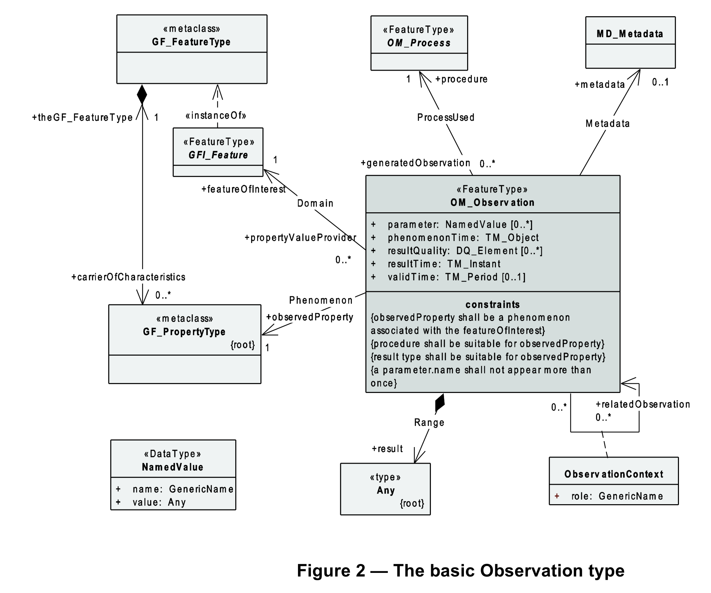
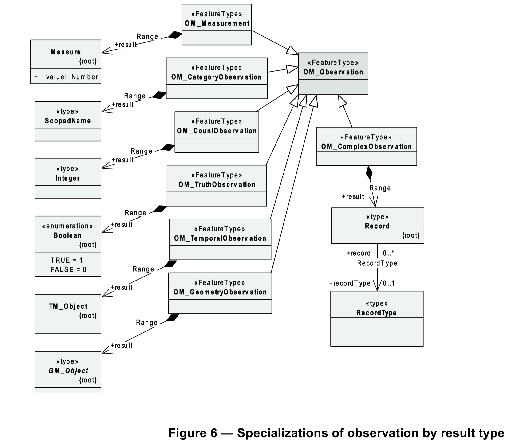

# OGC Observations and Measurements - Simple Feature model & encodings (OMSF)

---

**NOTE**: This document and the defined encodings are work-in-progress, and at this point, have not been endorsed by the OGC or any other standards organization. They may (and probably will) change in a backwards incompatible way during the drafting process.

There is an on-going discussion in leveraging the OMSF encodings
in the INSPIRE alternative encodings action ([MIWP 2017.2](https://ies-svn.jrc.ec.europa.eu/projects/2017-2/wiki)) for a simplified encoding of the INSPIRE O&M datasets.

The namespaces http://www.opengis.net/omsf-gml/1.0 and http://www.opengis.net/omsf-json/1.0 have not (yet)
been approved by the OGC Naming Authority, and thus may also change. Consider yourself warned.

---

Handling complex feature structure of the O&M XML Implementation
(as in OGC 10-025r1) typically creates a considerable additional implementation cost, added code complexity and lower
performance for both server and client software. The purpose of this activity is to define simple encodings for the most used O&M Observation types, and thus
enable interoperable O&M data exchange between existing software applications, servers and clients limited to using simple (non-complex)
GML features and/or GeoJSON.

## Design considerations

The following primary design goals have been followed (in priority order):

1. The defined feature types must be suitable for encoding using GML Simple Features Profile level SF-0 or SF-1.
1. Each defined feature type must have a relevant geometry property for spatial processing and map visualization purposes.
1. The defined feature types must follow the O&M model structure and property naming as long as it does not conflict with higher priority design goals.
1. The defined GML feature types should be as simple as possible, but not simpler (so called Einstein's razor).

In contrast to the OMXML (complex feature) implementation model, hard-typing is used for the different Observation types: ```GenericObservation```, ```MeasureObservation```, ```CategoryObservation```, ```CountObservation```, ```TruthObservation``` and ```MeasureTimeseriesObservation``` are each defined as separate feature types with fixed result value types. This is an intentional trade-off between simplicity and flexibility: Hard typing allows
for easier, more precise definition of the Observation content model, especially the observation result, in the APIs providing
OMSF data. On the other hand, the providing Observation data for novel result content type requires changes to the OMSF
model.

## ISO 19156 and the OMSF Implementation model
**TODO: Revise the following text and images based on the ISO 19156 Edition 2 changes**:

The figure below described a basic Observation feature type as defined in Observations and Measurements v2.0
([OGC Document 10-004r3](http://portal.opengeospatial.org/files/?artifact_id=41579), also published as [ISO 19156:2011,
Geographic information — Observations and Measurements](https://www.iso.org/standard/32574.html)).
\

Specialization of OM_Observation class by result type is described in the Figure 6:
\

Specialization of the OM_Observation class for Coverage valued results is described in the Figure 7:
\

The OMSF implementation model defines a simplified profile of the full O&M Observation model and the selected Specialized
Observation types mentioned in the figures above:

* OMSF does not include all the Specialized Observation types mentioned in ISO 19156:2011 (see the table below).
* OMSF observation model does not include the following of less commonly used OM_Observation class properties:
`parameter`, `relatedObservation` and `resultQuality`. The rationale for these exclusions is given below.
* OMSF properties are structured in a way that it is easy to encode them as simple features defined in GML Simple Features Profile version 2.0 ([OGC Document 10-100r3](http://portal.opengeospatial.org/files/?artifact_id=42729)).
* Geometry and display name of the feature-of-interest (FoI) are embedded in the OMSF Observations as their primary geometry and a dedicated name properties to enable access to the Observation location without resolving the FoI feature.
* Feature of interest of the OMSF observations is represented as separate properties for the *proximateFeatureOfInterest* and the *ultimateFeatureOfInterest*.
* to align with the [W3C Semantic Sensor Network Ontology specification](https://www.w3.org/TR/vocab-ssn/), the method and the implementation of the measurement procedure has been split into two separate properties: ```procedure``` and ```observer```.

\

The table below lists the O&M Core and Specialized Observation UML classes implemented in the OMSF implementation model
profile:

O&M v2.0 class | OGC name | OMSF feature|
---------------|----------|-------------------|
OM\_CategoryObservation | http://www.opengis.net/def/observationType/OGC-OM/2.0/OM_CategoryObservation | omsf:CategoryObservation
OM\_CountObservation | http://www.opengis.net/def/observationType/OGC-OM/2.0/OM_CountObservation | omsf:CountObservation
OM\_Measurement | http://www.opengis.net/def/observationType/OGC-OM/2.0/OM_Measurement | omsf:MeasureObservation
OM\_Observation | http://www.opengis.net/def/observationType/OGC-OM/2.0/OM_Observation | omsf:GenericObservation
OM\_TimeSeriesObservation | http://www.opengis.net/def/observationType/OGC-OM/2.0/OM_TimeSeriesObservation | omsf:MeasureTimeseriesObservation
OM\_TruthObservation | http://www.opengis.net/def/observationType/OGC-OM/2.0/OM_TruthObservation | omsf:TruthObservation
OM\_ComplexObservation | http://www.opengis.net/def/observationType/OGC-OM/2.0/OM_ComplexObservation | not implemented
OM\_DiscreteCoverageObservation | http://www.opengis.net/def/observationType/OGC-OM/2.0/OM_DiscreteCoverageObservation | not implemented
OM\_GeometryObservation | http://www.opengis.net/def/observationType/OGC-OM/2.0/OM_GeometryObservation | not implemented
OM\_PointCoverageObservation | http://www.opengis.net/def/observationType/OGC-OM/2.0/OM_PointCoverageObservation | not implemented
OM\_TemporalObservation | http://www.opengis.net/def/observationType/OGC-OM/2.0/OM_TemporalObservation | not implemented

Observations with complicated results, such as coverages, are in most cases out-of-scope of the OMSF context.
The implementation model is intentionally more limited than the one used for the
Observations and Measurements - XML Implementation ([OGC Document 10-025r1](http://portal.opengeospatial.org/files/?artifact_id=41510))
and OGC Observations and Measurements – JSON implementation ([OGC Document 15-100r1](https://portal.opengeospatial.org/files/64910))
which are able to express the full O&M abstract model. However, expressing any type of O&M Observation is possible by
using the ```omsf:GenericObservation``` feature type with a remote reference to the Observation result.

The simplified implementation models for the proximate and the ultimate feature of interest are realised
by embedding their essential properties into the Observation class itself.
The sampling feature is encoded by one mandatory property ```geometry``` and an optional property  ```proximateFeatureOfInterest```.
In a similar fashion the ultimate feature of interest (the model of the observed real-world object)
is encoded using an optional property: ```ultimateFeatureOfInterest```. The ```geometry``` property of a
OMSF Observation feature is the geometry of the sampling feature of the observation, or if no sampling
feature was used, a representative geometry of the ultimate feature of interest.

### Observation mapping
The implementation model of the OMSF Observation is a simplified version of the Observation class
as defined in the ISO 19156 standard. The following table summarises the simplification decisions applied:

O&M attribute/association | O&M type | O&M Multiplicity  | OMSF property | OMSF type |
--------------------------|----------|-------------------|--------------|-----------|
proximateFeatureOfInterest>geometry or ultimateFeatureOfInterest>geometry | association with AnyFeature | 1 | geometry | GM_Object |
ultimateFeatureOfInterest | association with AnyFeature | 0..n \*)| ultimateFeatureOfInterest | Reference to an external resource |
proximateFeatureOfInterest | association with AnyFeature | 0..n \*) | proximateFeatureOfInterest | Reference to an external resource |
metadata | association with Any | 0..* | metadata | Reference to an external resource |
observedProperty | association with ObservableProperty | 1..n | observedProperty | Reference to an external code list |
parameter | NamedValue | 0..n | n/a | n/a |
phenomenonTime | TM_Object | 1  | phenomenonTime | TM_Object |
procedure | association with Procedure | 1 | procedure | association with Procedure |
observer | association with Observer | 1 | observer | association with Observer |
observer>platform | association with Platform | 0..1 | platform | association with Platform
relatedObservation | association with self | 0..n |  n/a | n/a |
result | Any | 1 | result | varied |
result | Any | 1 | timeStep | TM_Instant |
result | Any | 1 | unitOfMeasure | Reference to an external code list |
resultQuality | DQ_Element | 0..n | n/a | n/a |
resultTime | TM_Instant | 1 | resultTime | TM_Instant |
validTime | TM_Period | 0..1 | validTime | TM_Period |
stimulusTime | TM_Instant | 0..1 | stimulusTime | TM_Instant |

\*) at least one of proximateFeatureOfInterest and ultimateFeatureOfInterest shall be given.

Rationale for the not included (n/a) properties:

* **parameter**: 0..n multiplicity of name-value pairs (as user defined types) would require compliance level SF-1, or a specially encoded list type. Trade-off between completeness and simplicity.
* **relatedObservation**: could be included technically (as a reference), but no way to specify the relation (role) without the user-defined types. Rarely used in practice.
* **resultQuality**: embedded quality info would a user-defined type and thus SF-1 level. Rarely used in practice,  trade-off between completeness and simplicity.

### Procedure mapping
Attribute/association | O&M type | O&M Multiplicity  |OMSF property | OMSF type |
--------------------------|----------|-------------------|--------------|-----------|
name | GenericName | 0..1 | name | GenericName
description | CharacterString | 0..1 | name | CharacterString

### Observer mapping
Attribute/association | O&M type | O&M Multiplicity  |OMSF property | OMSF type |
--------------------------|----------|-------------------|--------------|-----------|
name | GenericName | 0..1 | name | GenericName
description | CharacterString | 0..1 | name | CharacterString
observableProperty | association with ObservableProperty | 0..n | observableProperty | Reference to an external code list |
platform | association with Platform | 0..1 | platform | Reference to Platform |

### Platform mapping
Attribute/association | O&M type | O&M Multiplicity  |OMSF property | OMSF type |
--------------------------|----------|-------------------|--------------|-----------|
name | GenericName | 0..1 | name | GenericName
description | CharacterString | 0..1 | name | CharacterString
observer | association with Observer | 0..n | observer | association with Observer |

## GML and GeoJSON Encodings

OMSF contains both GML and GeoJSON encodings of the common OMSF implementation model defined above. For more details see

* [GML Simple Features Profile 2.0 encoding](./omsf-gml), and
* [GeoJSON encoding](./omsf-json/).

## Acknowledgements

Work on this application profile was initiated by Ilkka Rinne for the needs of Vaisala and Finnish Meteorological Institute in 2017.
